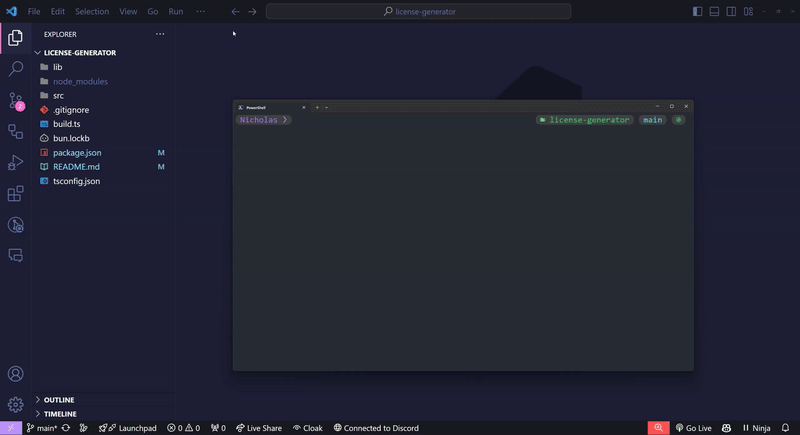

# License Generator

_A simple Node.js app to generate licenses for projects with one command!_



| **Currently Supported Licenses**     |
| ------------------------------------ |
| MIT License                          |
| GNU General Public License v3        |
| GNU Affero General Public License v3 |
| GNU Lesser General Public License v3 |
| Mozilla Public License v2            |
| Apache License v2                    |
| Boost Software License v1            |
| The Unlicense                        |

## Installation

Clone the repository and install dependencies

```bash
git clone "https://github.com/PeanutDumplings/license-generator.git" && cd license-generator && bun i
```

## Running

_You can either run the script in "dev" mode or run the pre-build js file_

**Development**

```bash
bun dev
```

**Production**

```bash
bun prod
```

_alternatively run_

```bash
node lib/index.js
```

## Adding a new license

The process for adding a new license is quite straightforward

1. Create a new file under `src/templates`. The naming "convention" is `{organisation name}-{license type}-{version}.ts`

2. In the created file, declare a new class with the same name as the filename but replace `-` (dashes) with `_` (underscores), and don't include the file extension:

```ts
class LICENSE_NAME {
  public content = ``; // Copy and paste the license contents exactly, with formatting kept.

  public readonly variables = [
    { name: "variable_1", value: "{variable_1}" }, // For placeholders: name property is the what will be displayed on script prefixed with "Enter ", value property is the actual text in the license to be replaced. Look at the MIT license for help
    // add more as needed
  ];
}

const license = new LICENSE_NAME();
export default license;
```

3. Add newly created license to licences array in `src/licenses.ts`

```ts
// ...
import the_unlicense from "./templates/the-unlicense";
import LICENSE_NAME from "./templates/LICENSE_NAME";

const licenses = [
  // ...
  { name: "the_unlicense", license: the_unlicense },
  { name: "LICENSE_NAME", license: LICENSE_NAME }, // convention for naming "name" property is same as class name in previous step
];

export default licenses;
```

4. Add license to choices in `src/index.ts`

```ts
const choice = await select({
  message: "Choose a license",
  choices: [
    // ...
    { name: "The Unlicense", value: "the_unlicense" },
    { name: "License Name", value: "LICENSE_NAME" }, // "name" property is what will be displayed on the select menu, "value" property must match exactly what the "name" property was set to in the licenses array in step 3
  ],
});
```

5. Done !
